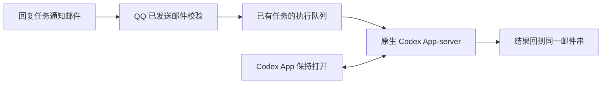

# Codex QQ Mail

**让 QQ 邮件接回你正在使用的 Codex 桌面任务。**

在 Mac 上发起任务，保持电脑清醒、联网、Codex App 打开。任务完成后收到邮件；直接回复那封邮件，Codex 在原任务中继续执行，再把结果回到同一邮件串。

这是一个本地运行的 macOS MVP：Python 后台负责收发、校验和排队，Codex 负责执行。没有新邮件时，不调用模型，也不消耗模型额度。项目使用 [MIT License](LICENSE)。

## 已实现

- 任务通知：默认一轮工作超过 10 分钟后通知；可明确让某个任务每轮都发，或仅发送一次。
- 同一 Codex 任务沿用同一个邮件串；每封邮件有独立 Message-ID。
- 只允许用户手动创建、明确启用邮件的已有任务；邮件不能创建新任务。
- App 保持打开。邮件与 App 共用原生执行服务，避免两个 CLI 进程争抢任务。
- 当前任务忙碌时等待；用原生队列提交后续指令，不抢占正在运行的一轮。
- 断线后找回原执行结果；不盲目重复执行。发送失败保留同一结果事件重试。
- 邮件授权码保存在 macOS Keychain，账户与状态保存在本机私有目录。



## 安装

需要 macOS、Python **3.11+**、已经登录的 Codex App，以及开启 IMAP/SMTP 的 QQ 邮箱。建议 Python **3.14+**，可使用 IMAP IDLE；较旧 Python 使用普通代码轮询，同样不调用模型。

本项目的原生集成测试使用 Codex bundled CLI **0.153.4**。连接使用实验性的 App-server 协议，升级 App 后应重新检查兼容性。

```sh
git clone https://github.com/KurosawaGeeker/codex-qq-mail.git
cd codex-qq-mail
python3 scripts/install.py --account you@qq.com --register-mcp --dry-run
```

把 `you@qq.com` 换成自己的 QQ 登录地址。先查看计划，确认无冲突，再去掉 `--dry-run` 安装：

```sh
python3 scripts/install.py --account you@qq.com --register-mcp
```

安装器建立独立 Python 环境、安装 Skill 和 MCP、配置本地启动服务。不会发邮件、运行模型或自动启用任务。已有安装、账户状态或自定义 CLI 设置会被保护，不会直接覆盖。

随后完成两步：

1. 用 **钥匙串访问**创建通用密码项目：名称为 `codex-qq-smtp-auth-code`，账户为安装时填写的 QQ 地址，密码为 QQ 的 IMAP/SMTP 授权码。直接在钥匙串界面填写，勿放进命令、`.env` 或聊天。
2. 完成正在执行的任务后，**首次重开 Codex App 一次**，加载新连接。之后远程使用时保持 App 打开即可，每次邮件交互无需重开。

详见 [安装、配置与卸载](docs/install.md)。本项目不会修改 App 二进制、删除任务锁或绕过 App 的进程授权。

## 使用

在你手动创建的 Codex 任务中说明：

> 给这个任务启用 QQ 邮件回复，并发一封测试邮件。

收到邮件后直接回复，例如：

> 请继续检查测试失败的原因，修好后告诉我结果。

要取消该任务的 10 分钟门槛：

> 这个任务以后每一轮完成都发邮件，不管用了多久。

只发这一次：

> 把这次结果发到我的邮箱。

安装的 Skill 指导 Codex 使用当前真实任务 ID。通知规则由 Skill 和工具调用执行；安装后台本身不会自动接管所有任务。首次验收建议让邮件指令读取一个无敏感内容的本地文件，确认 **原任务出现记录、文件内容正确、结果邮件收到**。

## 为什么别人发来的邮件不能直接执行

监听器读取配置账户经过认证的 **Sent Messages（已发送）** 文件夹，并同时核对启用时的基线、已发通知的 Message-ID 和邮件回复链。普通收件箱来信不会进入执行队列。已发送文件夹是信任边界，请勿将别人的邮件移入其中来绕过校验。

邮件串 UUID 用于定位任务，不是身份认证。`From` 地址或 UUID 单独匹配也不能启动执行。QQ 改写发送邮件的 Message-ID 时，服务会先根据本账户的已发送副本校正对应关系。

## 边界与故障处理

- 电脑休眠、合盖或断网时，无法保证及时处理；恢复连接后会重新检查。
- 目前只支持本机、单个配置 QQ 账户及明确启用的已有任务。
- 原生工具照常执行；需要审批、用户输入或未知客户端工具请求时会报告状态，不自动批准或伪造结果。
- 若执行结果不确定，保留原 claim 和执行记录，不重新提交原指令。
- `accepted` 表示 SMTP 已接收，不等于用户已看到邮件。SMTP 结果不确定时，需确认收件或明确授权可能重复的重发。
- 私有状态可能包含待处理邮件和执行输出。不要把状态数据库、日志或邮件原文上传到 issue。

恢复和权限边界见 [Skill](skills/qq-mail/SKILL.md) 与 [安全说明](SECURITY.md)。

## 开发与验证

```sh
python3 -m venv .venv
.venv/bin/python -m pip install -r requirements.txt
.venv/bin/python -m unittest discover -s tests
.venv/bin/python scripts/check_release.py
```

常规测试使用合成邮件和临时目录，不连接真实邮箱或调用真实模型。原生集成测试需要显式指定本机 Codex 可执行文件：

```sh
QQ_SHARED_NATIVE_TESTS=1 \
CODEX_QQ_MAIL_TEST_CLI='/Applications/Codex.app/Contents/Resources/codex' \
.venv/bin/python -m unittest discover -s tests -p test_shared_executor.py
```

它使用临时 Codex 配置和本地固定响应，验证同一任务上下文、工具执行、忙碌等待与丢失提交回执后的恢复。原生协议测试不能代替你的真实 App 和邮箱验收。

```text
scripts/                 收发服务、执行适配器、安装与发布检查
tests/                   合成邮件、状态恢复和原生集成测试
skills/qq-mail/SKILL.md   Codex 使用规则
docs/install.md          安装、钥匙串、验收与卸载
```

发布前还应扫描整个 Git 历史，并人工检查发布文件；`check_release.py` 只是基础保护。贡献约定见 [CONTRIBUTING.md](CONTRIBUTING.md)。

## License

[MIT](LICENSE)。本项目是独立社区工具，并非 OpenAI 或腾讯的官方产品。
